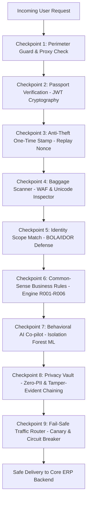

# ERP Security Gateway: Complete End-to-End Plain English Guide

> **Target Audience:** New Developers, System Administrators, Security Analysts, and Non-Technical Stakeholders.  
> **Goal:** Understand what the ERP Security Gateway does, how every request is protected, and how to test and run it in 5 minutes.

---

## 1. The Big Picture: What is this and why does it exist?

### The Bank Vault Analogy
Imagine your company's **ERP (Enterprise Resource Planning)** system is the central bank vault. Inside that vault sits:
* Customer credit cards, bank accounts, and invoices.
* Confidential product pricing, discount tables, and margins.
* Employee payroll, social security numbers, and addresses.
* Warehouse physical inventory stocks and supply chain shipments.

If you connect this ERP system directly to the corporate network or internet without a defense gateway, **every computer in the world can knock directly on the vault door**. If a single ERP endpoint has a bug, the entire company's data can be stolen or wiped out.

```
Without Security Gateway:
[Untrusted Internet] ────────────────────────────────────────► [ERP Core Database & Vault]  (HIGH RISK!)

With ERP Security Gateway:
                                   ┌───────────────────────────────┐
[Untrusted Internet] ────────────► │   ERP SECURITY GATEWAY        │ ────────► [ERP Core Database & Vault]
                                   │   (9 Automated Checkpoints)   │           (PROTECTED!)
                                   └───────────────────────────────┘
```

The **ERP Security Gateway** sits in front of the ERP like an **elite airport security checkpoint**. Every request that enters must present a valid passport (cryptographic JWT), pass through an X-ray scanner for weapons (WAF for SQL injections), show a one-time boarding pass stamp (anti-replay nonce), and prove they own the ticket (object-level authorization).

---

## 2. The 9 Security Checkpoints: The Journey of a Request

Every HTTP request follows this sequential 9-step pipeline before it is ever allowed to touch the real ERP backend:



### Checkpoint 1: Perimeter Guard & Trusted Proxy Validation
* **In Simple Words:** Who is actually standing at the door?
* **How it Works:** When a request arrives, attackers often try to forge headers like `X-Forwarded-For: 127.0.0.1` to pretend they are calling from inside the company. The gateway checks the **immediate TCP connection**. If the connection did not come from an approved load balancer (like AWS ALB or Nginx), the fake header is stripped, and the attacker's real external IP is used.
* **Key Code:** [`gateway/config.py`](file:///d:/ERP%20security/gateway/config.py#L35) (`get_verified_client_ip`)

---

### Checkpoint 2: Passport Verification & Cryptographic Signature Check
* **In Simple Words:** Is this ID badge real, or printed on a home printer?
* **How it Works:** The gateway uses **JSON Web Tokens (JWT)**. A JWT is a digital ID card. It contains user details (e.g., `user: sales_john`, `role: sales`). Crucially, it has a **cryptographic digital signature**. If an attacker edits the text to say `role: admin`, the cryptographic signature breaks. The gateway rejects forged or unsigned tokens in less than 0.2 milliseconds.
* **Attack Blocked:** Forged admin access tokens (`HTTP 401 Unauthorized`).
* **Key Code:** [`gateway/auth_engine.py`](file:///d:/ERP%20security/gateway/auth_engine.py#L30) (`verify_token`)

---

### Checkpoint 3: Anti-Theft One-Time Stamp (Replay Defense)
* **In Simple Words:** You can only cash a check once.
* **How it Works:** Suppose you submit a valid payment request: *"Pay $1,000 to Vendor X"*. If a hacker records your network traffic, they could replay that same message 100 times to steal $100,000. To stop this, the gateway requires two headers on all money or state-changing actions (`POST`, `PUT`, `DELETE`):
  1. `X-Timestamp`: Current time in UTC. If older than 5 minutes, it is rejected.
  2. `X-Nonce`: A random, unique cryptographic string used once. The gateway stores used nonces in a distributed Redis database. If the same nonce is seen twice, it is instantly rejected.
* **Attack Blocked:** Replayed transactions, duplicate payments, unauthorized order spam (`HTTP 400 Bad Request`).
* **Key Code:** [`gateway/replay_guard.py`](file:///d:/ERP%20security/gateway/replay_guard.py#L35) (`validate_request`)

---

### Checkpoint 4: Baggage Scanner (WAF & Unicode Unescaping)
* **In Simple Words:** X-raying every luggage item for hidden knives and weapons.
* **How it Works:** Attackers try to sneak SQL Injection commands (like `' OR 1=1 --`) into order forms, delivery notes, or search boxes. Advanced hackers disguise their attacks using Unicode escapes (e.g., `\u0027` instead of `'`). The gateway unescapes all Unicode characters and recursively scans every nested JSON key and list value before forwarding.
* **Attack Blocked:** SQL Injection, Cross-Site Scripting (XSS), Directory Traversal (`HTTP 403 Forbidden`).
* **Key Code:** [`gateway/waf.py`](file:///d:/ERP%20security/gateway/waf.py#L60) (`inspect_content`, `inspect_payload`)

---

### Checkpoint 5: Identity Scope Match (BOLA / IDOR Defense)
* **In Simple Words:** You can look at your bank account, but never someone else's.
* **How it Works:** Broken Object-Level Authorization (BOLA/IDOR) is the #1 vulnerability on the internet. An attacker logs in as legitimate Customer A (`cust-101`), but then requests `GET /api/orders/202` (which belongs to competitor Customer B). The gateway inspects the user ID embedded in the cryptographic passport and ensures Customer A can only read and mutate Customer A's objects. Staff roles (like sales, warehouse, and admins) retain appropriate multi-tenant access.
* **Attack Blocked:** Competitor price peeking, order theft, invoice exfiltration (`HTTP 403 Forbidden`).
* **Key Code:** [`gateway/auth_engine.py`](file:///d:/ERP%20security/gateway/auth_engine.py#L85) (`check_bola_idor`)

---

### Checkpoint 6: Common-Sense ERP Business Rules (R001–R006)
* **In Simple Words:** Computers must not accept impossible real-world transactions.
* **How it Works:** Even if a request looks syntactically valid, does it make business sense? The gateway includes a lightning-fast deterministic rules engine:
  * **Rule R001:** Negative product pricing (e.g., buy 1 laptop for `-$500` to drain company funds).
  * **Rule R002:** The exact same order placed twice within 5 seconds (accidental double-click or bot glitch).
  * **Rule R003:** Large bulk price discount applied by unauthorized non-management roles.
  * **Rule R004:** Order quantity exceeding total physical warehouse inventory.
  * **Rule R005:** High-velocity order placement from a brand new account created minutes ago.
  * **Rule R006:** Mass scraping: a single user downloading more than 50 orders in 60 seconds.
* **Attack Blocked:** Business logic abuse, inventory drainage, pricing fraud (`HTTP 403 Forbidden`).
* **Key Code:** [`gateway/rules_engine.py`](file:///d:/ERP%20security/gateway/rules_engine.py#L120) (`evaluate`)

---

### Checkpoint 7: Behavioral AI Co-pilot (Isolation Forest Machine Learning)
* **In Simple Words:** An AI security guard watching for weird behavior patterns.
* **How it Works:** The gateway extracts 16 behavioral features on every request (request size, time of day, department velocity, historical baseline). An **Isolation Forest ML model** evaluates whether this action is statistically abnormal.
* **Crucial Enterprise Safety Rule:** To prevent false alarms from halting critical business shipments, the ML model is **advisory only**. It alerts security analysts (SOC) and scores risk, but deterministic rules make the final blocking decisions.
* **Alert Deduplication:** Repetitive anomaly alerts are clustered within a 60-second sliding window to eliminate alert fatigue for human analysts.
* **Key Code:** [`ml/model_service.py`](file:///d:/ERP%20security/ml/model_service.py), [`ml/retraining_pipeline.py`](file:///d:/ERP%20security/ml/retraining_pipeline.py)

---

### Checkpoint 8: Privacy Vault & Tamper-Evident Black Box
* **In Simple Words:** Protect customer privacy and ensure audit logs cannot be forged or deleted.
* **How it Works:**
  1. **Zero-PII Privacy (GDPR Compliance):** When logging what happened, real customer IP addresses and passwords are never written to disk in plain text. IPs are converted into salted cryptographic pseudonyms (e.g., `p-32503b6b43e1...`).
  2. **Tamper-Evident Audit Chaining:** Every log entry contains a cryptographic seal (`HMAC-SHA256`) that includes the seal of the previous log entry. If a corrupt insider modifies a log or deletes an entry, the chain breaks and the gateway immediately flags an alarm.
* **Regulatory Proof:** Audit packages for **SOC 2 Type II**, **ISO 27001**, **GDPR Art 32**, and **SOX 404** can be exported in one API call.
* **Key Code:** [`gateway/telemetry/redaction.py`](file:///d:/ERP%20security/gateway/telemetry/redaction.py), [`gateway/compliance.py`](file:///d:/ERP%20security/gateway/compliance.py)

---

### Checkpoint 9: Fail-Safe Traffic Control (Canary & Circuit Breaker)
* **In Simple Words:** Safe deployments and shock absorbers against ERP crashes.
* **How it Works:**
  1. **Canary Deployments:** When upgrading the gateway, traffic routes progressively: 1% -> 10% -> 50% -> 100%. If error rates exceed 1% or latency spikes, it **automatically rolls back to 0% in under 1 second** without human intervention.
  2. **High Availability Circuit Breaker:** If the ERP core database becomes slow or unresponsive, the circuit breaker opens, returning an immediate, polite `HTTP 503 Service Unavailable (Retry-After: 10)` rather than letting incoming traffic pile up and crash the server.
* **Key Code:** [`gateway/canary_router.py`](file:///d:/ERP%20security/gateway/canary_router.py), [`gateway/ha_dr.py`](file:///d:/ERP%20security/gateway/ha_dr.py)

---

## 3. Quick Comparison: Normal User vs. Attacker

| Scenario | What the Client Sends | Gateway Action | Result |
| :--- | :--- | :--- | :---: |
| **Normal Purchase** | Valid JWT, fresh Nonce, clean JSON items | All 9 checkpoints pass | `HTTP 200 OK` (Processed) |
| **Tampered Token** | JWT with altered claims (`role: admin`) | Checkpoint 2 signature check fails | `HTTP 401 Unauthorized` |
| **Replay Attack** | Intercepted valid request sent a second time | Checkpoint 3 detects duplicate nonce in Redis | `HTTP 400 Bad Request` |
| **SQL Injection** | `{"notes": "\u0027 OR 1=1 --"}` | Checkpoint 4 unescapes Unicode and detects SQLi | `HTTP 403 Forbidden` |
| **Cross-Tenant Theft** | User A requesting `/api/orders/999` (User B's order) | Checkpoint 5 detects tenant ownership mismatch | `HTTP 403 Forbidden` |
| **Negative Price Scam** | `{"total_amount": -50.0}` | Checkpoint 6 Rule R001 fires | `HTTP 403 Forbidden` |
| **Overloaded ERP** | Upstream ERP database crashes | Checkpoint 9 Circuit Breaker trips | `HTTP 503 Retry-After` |

---

## 4. Hands-on: Try It In 5 Minutes (For Developers)

Follow these steps to run the gateway, verify all defenses, and see it in action.

### Step 1: Run the Interactive Visual Demonstration
We have included a visual demo script that tests all 8 attack scenarios right in your terminal:
```bash
python scripts/demo_end_to_end.py
```
*You will see instant color-coded passes demonstrating each attack being blocked in real time.*

### Step 2: Run the Automated Quality Verification Suite (193 Tests)
To verify that 100% of security rules, adversarial tests, and performance SLAs are working:
```bash
python -m pytest tests -q
```
*Expected output: `193 passed in ~65s (100% PASS)`*

### Step 3: Run the Official Enterprise Production Readiness Audit
Run the automated auditor that evaluates all 12 operational phases:
```bash
python scripts/verify_production_readiness.py
```
*Expected output: `12/12 Phases Passed (100.0%) - CERTIFICATION: PASSED`*

### Step 4: Run the Real Multi-Threaded TCP Socket Benchmark
Test real network throughput and sub-80ms p95 latency overhead:
```bash
python benchmarks/socket_benchmark.py
```
*Expected output: `40/40 passed (100% success rate), p50: ~53ms, p95: ~72ms - SLA PASSED`*

### Step 5: Start the Full Multi-Container Docker Stack
To run Nginx, Gateway, Redis 7, and the Staging ERP Backend together:
```bash
# 1. Copy production configuration template
cp .env.example .env

# 2. Spin up the container stack
docker compose up --build -d

# 3. Check container health
docker compose ps
```
The gateway will be running at `http://localhost:8080/api/` via Nginx!

---

## 5. Plain English Glossary of Terms

* **ERP (Enterprise Resource Planning):** The core enterprise software (SAP, NetSuite, Oracle) managing all company finances, products, and personnel.
* **JWT (JSON Web Token):** A digital, tamper-proof identity passport signed by cryptographic math.
* **Nonce (Number Used Once):** A random one-time code added to a request so it cannot be copied and sent twice.
* **WAF (Web Application Firewall):** A digital baggage scanner looking for malicious code inside request text.
* **BOLA / IDOR (Broken Object-Level Authorization):** A bug where an app lets User A view or delete User B's private documents.
* **Circuit Breaker:** An automatic electrical switch. If the server gets overheated, it trips off temporarily to prevent a fire.
* **Canary Deployment:** Testing a new software update on 1% of users before rolling it out to everyone.
* **Zero-PII (Personally Identifiable Information):** A privacy standard guaranteeing no names, raw IPs, or passwords leak into logs.
* **HMAC (Hash-based Message Authentication Code):** A digital wax seal ensuring no one altered a message or log file.
