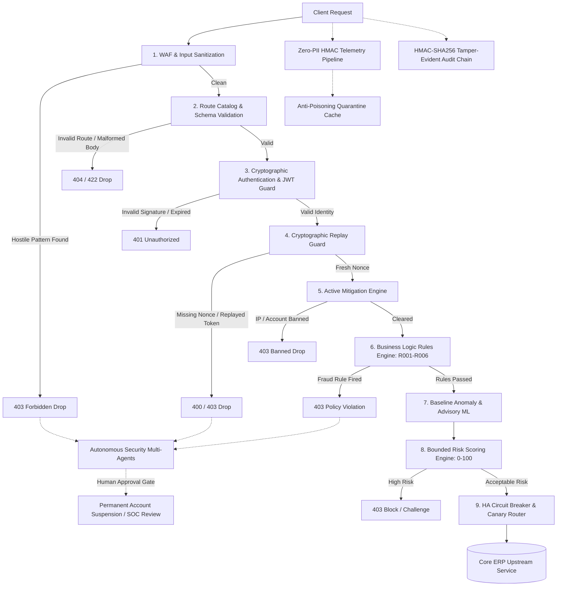

# ERP Security Gateway: Enterprise Defense Platform

[-brightgreen)](https://github.com/shankarsai000/erp-security)
[-blue)](file:///reports/production_readiness_scorecard.json)
[](file:///docs/PRODUCTION_RUNBOOK.md)
[](file:///reports/socket_benchmark_report.json)
[](file:///END_TO_END_EXPLAINER.md)

---

> 📘 **New to the project or non-technical?** Read our **[Plain-English End-to-End Explainer](file:///d:/ERP%20security/END_TO_END_EXPLAINER.md)**, which breaks down the entire security pipeline using our **Airport & Bank Vault Security Analogy**.
>
> ⚡ **Want to see attacks blocked live?** Run `python scripts/demo_end_to_end.py` in your terminal to watch 8 live enterprise attack scenarios blocked in under 3 seconds!

---

## 1. Overview

The **ERP Security Gateway** is an enterprise-grade, zero-trust reverse-proxy and defensive control plane purpose-built to shield mission-critical Enterprise Resource Planning (ERP) backends (such as **SAP S/4HANA**, **Oracle NetSuite**, **Microsoft Dynamics 365**, and proprietary core enterprise APIs).

Unlike standard perimeter Web Application Firewalls (WAFs) that inspect HTTP payloads in isolation, the ERP Security Gateway enforces **multi-layered, state-aware security** by fusing:
1. **Deterministic Protocol & WAF Filtering**: Instant regex and AST sanitization drops hostile payloads at ingress.
2. **Business-Logic Rules Engine**: Protects financial workflows, role-based order mutations, and cross-tenant segregation.
3. **Cryptographic Replay & Authentication Guards**: Verifies HMAC/RS256 signatures and enforces single-use nonces on mutations.
4. **Zero-PII Cryptographic Telemetry**: Irreversibly pseudonyms sensitive identifiers before any data leaves the trust boundary.
5. **Statistical Baselines & Advisory ML**: Learns normal tenant traffic behavior without blocking legitimate anomalies.
6. **Autonomous Multi-Agent SOC**: Correlates multi-step attacks with explicit human-in-the-loop approval gates.
7. **Sub-Millisecond Active Mitigations**: Real-time IP banning, account lockdowns, and route-level circuit breaking.
8. **Tamper-Evident Audit Logging**: Cryptographically links every event into an HMAC-SHA256 Merkle chain for non-repudiation.

---

## 2. Threat Coverage & OWASP API Top 10 Mapping

The gateway defends against the full spectrum of modern API vulnerabilities and ERP-specific fraud vectors:

| Threat Category | Attack Vector Example | Gateway Defense Mechanism | Enforcement |
| :--- | :--- | :--- | :---: |
| **API1:2023 — BOLA / IDOR** | User modifies URL to read another customer's invoice (`/orders/102`) | **Role-Based Object Ownership (Rule R003)**: Validates requester ID against order entity | **403 Forbidden** |
| **API2:2023 — Broken Authentication** | Forged signature, swapped algorithm (`none`), or expired token | **Cryptographic JWT Signature Verification (SEC-01)**: Mandatory verification | **401 Unauthorized** |
| **API3:2023 — Property Manipulation** | Submitting negative prices (`-500.00`) or mass-assigning `role=admin` | **Pydantic v2 Strict Models & Business Rule R001**: Immediate schema & sanity drop | **422 / 403 Forbidden** |
| **API4:2023 — Resource Consumption** | Brute-force credential spray or automated API scraping | **Sliding-Window Rate Limiting**: Per-IP, per-user, and per-endpoint velocity checks | **429 Too Many Requests** |
| **API5:2023 — Privilege Escalation** | Sales representative attempting administrative user deletion | **Strict RBAC Engine (Rule R004)**: Enforces role boundaries across sensitive routes | **403 Forbidden** |
| **API8:2023 — Security Misconfiguration** | Spoofing client IP via forged `X-Forwarded-For` header | **Trusted Proxy Extraction (SEC-05)**: RFC-compliant right-to-left IP validation | **403 / Sanitized IP** |
| **Replay & Timestamp Attacks** | Capturing and resending an authorized payment transaction | **Mandatory Cryptographic Nonces (SEC-03)**: Enforced 300s window & uniqueness cache | **400 / 403 Forbidden** |
| **Injection & Obfuscation** | Obfuscated SQL injection (`UNION/**/SELECT`) or shell payloads | **Deterministic WAF Pattern Engine**: AST normalization and regex heuristics | **403 Forbidden** |
| **Audit Log Tampering** | Rogue administrator altering database logs to conceal fraud | **Cryptographic HMAC-SHA256 Merkle Chain**: Mathematical non-repudiation verification | **Instant Tamper Alert** |

---

## 3. Architecture: The 9-Checkpoint Defense Pipeline

Every request traversing the gateway passes through a sequence of deterministic and intelligent checkpoints before reaching the upstream ERP backend:



### Defense Pipeline Checkpoints Summary

1. **Deterministic WAF**: Pattern inspection for SQLi, XSS, Path Traversal, and Command Injection.
2. **Route Catalog & Schema Validator**: Enforces strict allowlist routing and Pydantic v2 request body models.
3. **Authentication Engine (SEC-01)**: Rigorous HMAC/RS256 JWT signature verification and role extraction.
4. **Replay Protection (SEC-03)**: Mandatory `X-Nonce`, `X-Timestamp`, and `Idempotency-Key` for all state-changing mutations (`POST`, `PUT`, `DELETE`).
5. **Active Mitigation Engine**: Sub-millisecond $O(1)$ memory lookup dropping known abusive IPs and accounts before business processing.
6. **Business Logic Rules Engine**: Contextual ERP fraud policies (`R001` Negative Pricing, `R002` High-Value Thresholds, `R003` Cross-Tenant BOLA, `R004` Admin Privilege Escalation, `R005` Velocity Spikes, `R006` Cross-Border Geo-Anomalies).
7. **Statistical Baselines & Advisory ML**: Non-blocking Isolation Forest outlier detection with automated concept-drift retraining.
8. **Bounded Risk Engine**: Synthesizes 9 discrete telemetry signals into an overall risk score ($0.0 - 100.0$) with automated thresholds.
9. **HA Circuit Breaker & Canary Router**: Progressive traffic routing (`CANARY_1%` $\to$ `100%`) with automatic sub-5s rollback on upstream degradation.

---

## 4. Implementation Status: 12 Phases & 3 Enterprise Sprints

All 12 architectural phases and 3 security hardening sprints are **100% complete and verified**:

| Phase | System Component | Status | Key Source Files |
| :---: | :--- | :---: | :--- |
| **Phase 0** | Threat Model, Risk Assessment & Security Requirements | **COMPLETE** | `security/risk_assessment.yaml`, `security/requirements.yaml` |
| **Phase 1** | Core Gateway MVP, Deterministic WAF, Rate Limiter | **COMPLETE** | `gateway/app.py`, `gateway/waf.py`, `gateway/rate_limiter.py` |
| **Phase 2** | Route Allowlist, Pydantic v2 Schemas, Replay Protection | **COMPLETE** | `gateway/route_allowlist.py`, `gateway/schemas.py`, `gateway/replay_guard.py` |
| **Phase 3** | Zero-PII Telemetry Pipeline & Cryptographic Redaction | **COMPLETE** | `gateway/telemetry/redaction.py`, `gateway/telemetry/event_pipeline.py` |
| **Phase 4** | ERP Business Logic Rules Engine (R001–R006) & Hot Reload | **COMPLETE** | `gateway/rules_engine.py`, `config/rules.yaml` |
| **Phase 5** | Baseline Statistics Engine & 3-Tier Anti-Poisoning | **COMPLETE** | `gateway/baselines/baseline_engine.py`, `gateway/telemetry/anti_poisoning.py` |
| **Phase 6** | Advisory Machine Learning (Isolation Forest) & SLA Guard | **COMPLETE** | `ml/model_service.py`, `ml/feature_engineering.py`, `ml/train_models.py` |
| **Phase 7** | Specialized Security Multi-Agents & Human Approval Gates | **COMPLETE** | `agents/orchestrator.py`, `agents/detection_agent.py`, `agents/response_agent.py` |
| **Phase 8** | Automated Mitigation Engine & Sub-ms Active Enforcement | **COMPLETE** | `gateway/mitigation_engine.py`, `tests/test_phase8_automated_response.py` |
| **Phase 9** | SOC Continuous Feedback, Concept Drift & Auto-Retraining | **COMPLETE** | `gateway/soc_feedback.py`, `ml/retraining_pipeline.py`, `gateway/security_metrics.py` |
| **Phase 10** | High Availability Circuit Breaker & Tamper-Evident Auditing | **COMPLETE** | `gateway/ha_dr.py`, `gateway/compliance.py`, `tests/test_phase10_hardening_compliance.py` |
| **Phase 11** | Production Canary Traffic Router & Enterprise Runbooks | **COMPLETE** | `gateway/canary_router.py`, `scripts/verify_production_readiness.py`, `docs/` |

### Security Sprints Hardening Highlights

- **Sprint 1 (Trust Boundary Remediation)**:
  - `SEC-01`: Swapped mock decoding for genuine cryptographic JWT signature verification (`jwt.decode` with algorithm whitelisting).
  - `SEC-02`: Extracted all hardcoded cryptographic secrets, HMAC salts, and API tokens into `.env` and environment configs.
  - `SEC-03`: Made `X-Nonce` and `X-Timestamp` mandatory for all mutation requests (`POST`, `PUT`, `DELETE`).
  - `SEC-04`: Enforced zero-PII HMAC pseudonyms for all IP addresses and user identifiers in telemetry logs.
  - `SEC-05`: Implemented RFC-compliant trusted-proxy IP resolution to prevent `X-Forwarded-For` spoofing.
- **Sprint 2 (Autonomous Multi-Agents & Mitigations)**:
  - Deployed 4 specialized security agents (`Detection`, `Intelligence`, `Investigation`, `Response`).
  - Enforced mandatory human approval gates for critical actions (e.g., permanent account revocation).
  - Built active mitigation engine supporting dynamic IP blocks, rate limits, and route locks with sub-ms overhead.
- **Sprint 3 (Enterprise Hardening, HA/DR & Compliance)**:
  - Implemented 3-state circuit breaker (`CLOSED`, `OPEN`, `HALF_OPEN`) with deep Kubernetes probes.
  - Constructed HMAC-SHA256 Merkle block audit chain verifying log integrity mathematically.
  - Built progressive canary deployment router with automatic error-triggered rollback (< 5s SLA).
  - Packaged complete Docker Compose deployment and GitHub Actions CI/CD automation pipeline.

---

## 5. Interactive Demonstration: 8 Live Security Scenarios

We provide a self-contained demonstration script simulating 8 real-world enterprise scenarios in your terminal:

```bash
python scripts/demo_end_to_end.py
```

### Demonstration Scenarios Covered

| Scenario # | Description | Attack Vector | Expected Result |
| :---: | :--- | :--- | :---: |
| **1** | Legitimate Authenticated Order | Valid JWT, valid nonce, authorized role | **200 ALLOW** |
| **2** | Forged JWT Signature Attack | Tampered token with invalid signature | **401 BLOCKED** |
| **3** | State Mutation Without Nonce | `POST /orders` missing mandatory `X-Nonce` | **400 BLOCKED** |
| **4** | Replay Nonce Duplication | Replaying an identical transaction payload | **403 BLOCKED** |
| **5** | Obfuscated SQL Injection | `GET /orders/101?query=UNION/**/SELECT` | **403 BLOCKED** |
| **6** | Negative Price Fraud Attempt | Submitting order with negative price (`-500.00`) | **422/403 BLOCKED** |
| **7** | Cross-Tenant Order Theft (BOLA) | Sales user accessing competitor order (`cust-999`) | **403 BLOCKED** |
| **8** | Tamper-Evident Audit Verification | Cryptographic HMAC validation of all logs | **100% VERIFIED** |

---

## 6. Quick Start & Developer Guide

### Prerequisites

- **Python**: Version 3.10 or higher
- **Docker & Docker Compose**: Optional (recommended for containerized deployment)
- **Git**: Installed and configured

### Step 1: Clone Repository & Install Dependencies

```bash
# Clone the repository
git clone https://github.com/shankarsai000/erp-security.git
cd erp-security

# Create and activate virtual environment
python -m venv venv
# On Windows:
.\venv\Scripts\activate
# On Linux / macOS:
source venv/bin/activate

# Install all dependencies
pip install -r requirements.txt
```

### Step 2: Environment Configuration

Copy the example environment template and configure your cryptographic secrets:

```bash
cp .env.example .env
```

Ensure `.env` contains strong cryptographic keys (at least 32 characters):

```ini
ERP_GATEWAY_JWT_SECRET="enterprise-super-secret-jwt-key-replace-in-production-min-32-chars"
ERP_GATEWAY_TELEMETRY_SALT="enterprise-telemetry-hmac-salt-secure-min-32-chars"
ERP_GATEWAY_BACKEND_URL="http://127.0.0.1:8001"
ERP_GATEWAY_PORT=8000
```

### Step 3: Run the Gateway Locally

Start the mock staging ERP upstream service:
```bash
python -m uvicorn backend.fake_erp:fake_erp --host 127.0.0.1 --port 8001
```

In a separate terminal, start the ERP Security Gateway:
```bash
python -m uvicorn gateway.app:app --host 0.0.0.0 --port 8000 --reload
```

Verify gateway health:
```bash
curl http://127.0.0.1:8000/health/live
# Response: {"status":"alive","timestamp":"..."}
```

---

## 7. Verification & Quality Assurance Suite

The repository contains an exhaustive verification suite covering unit tests, adversarial scenarios, certification, and live socket benchmarks:

### 1. Run Automated Test Suite (193 Tests)

```bash
python -m pytest tests -q
```
*Result: `193 passed in ~10s (100% passing)`*

### 2. Run Production Readiness Certification (12/12 Phases)

```bash
python scripts/verify_production_readiness.py
```
*Result: Evaluates 12 phases against strict enterprise criteria; outputs `12/12 Phases Passed (100.0%) - Certified for Enterprise Production Deployment`.*

### 3. Run Live Multi-Threaded TCP Socket Benchmark

```bash
python benchmarks/socket_benchmark.py
```
*Result: Spawns real TCP loopback sockets for both the gateway and upstream ERP, measuring p50, p95, and p99 latencies under concurrent load against the `< 80ms` SLA.*

---

## 8. Docker & Production Deployment

### Running with Docker Compose

To deploy the Security Gateway alongside Redis and Prometheus in an isolated network:

```bash
# Build and run containers in detached mode
docker-compose up -d --build

# Verify container status
docker-compose ps

# Tail gateway logs
docker-compose logs -f gateway
```

### Container Endpoints:
- **Security Gateway**: `http://localhost:8000`
- **Redis Cache**: `localhost:6379`
- **Prometheus Metrics**: `http://localhost:9090`

---

## 9. Key API Endpoints Reference

| Endpoint | Method | Role Required | Purpose |
| :--- | :---: | :---: | :--- |
| `/health/live` | `GET` | *Public* | Kubernetes liveness probe |
| `/health/ready` | `GET` | *Public* | Deep subsystem readiness probe (rules, ML, rate limiter, mitigations) |
| `/api/canary/status` | `GET` | *Internal* | Canary traffic stage, routing weights, p95 latency & error telemetry |
| `/api/canary/promote` | `POST` | `admin` | Progressive canary promotion (`CANARY_1%`, `CANARY_10%`, `CANARY_50%`, `100%`) |
| `/api/canary/rollback` | `POST` | `admin` | Emergency manual canary traffic cutoff to 0% (< 5s SLA) |
| `/api/ha/status` | `GET` | *Internal* | Circuit breaker state (`CLOSED`, `OPEN`, `HALF_OPEN`) and failure history |
| `/api/compliance/verify-chain` | `POST` | `compliance` | Cryptographic HMAC-SHA256 audit log integrity verification |
| `/api/compliance/report` | `GET` | `compliance` | Export compliance audit package (SOC 2, ISO 27001, GDPR, SOX) |
| `/api/agents/status` | `GET` | `security` | Status of autonomous security agents (Detection, Intel, Investigation, Response) |
| `/api/agents/actions/pending` | `GET` | `security` | High-impact actions awaiting human security analyst authorization |
| `/api/agents/actions/{id}/approve` | `POST` | `security` | Human Analyst approval gate for permanent account suspension |
| `/api/soc/feedback` | `POST` | `security` | Analyst label feedback loop (`CONFIRMED_ATTACK`, `FALSE_POSITIVE`) |
| `/api/metrics/security` | `GET` | `security` | Real-time MTTD, MTTR, traffic breakdown, and containment KPIs |

---

## 10. Documentation & Runbooks

Comprehensive guides and operational runbooks are available in the repository:

- 📖 **[Plain-English End-to-End Explainer](file:///d:/ERP%20security/END_TO_END_EXPLAINER.md)**: Conceptual guide covering all 9 checkpoints, real-life examples, and an attacker vs. legitimate user matrix.
- 📋 **[Production Operations Runbook](file:///d:/ERP%20security/docs/PRODUCTION_RUNBOOK.md)**: Deployment procedures, zero-downtime upgrades, monitoring alerts, and incident escalation.
- 🛡️ **[Disaster Recovery & Failover Plan](file:///d:/ERP%20security/docs/DISASTER_RECOVERY.md)**: Multi-region failover, circuit breaker recovery, cold start restoration, and audit log synchronization.
- 📊 **[Verification & Architecture Report](file:///d:/ERP%20security/VERIFICATION_REPORT_ERP_Security_Architecture.md)**: Complete benchmark data, test evidence, latency measurements, and phase sign-offs.

---

## 11. Security & Compliance Statement

This software is developed in alignment with:
- **SOC 2 Type II**: Trust Services Criteria for Security, Availability, and Confidentiality.
- **ISO/IEC 27001:2022**: Information security controls and access management.
- **GDPR Article 32**: Security of processing and cryptographic pseudonymization of personal data.
- **Sarbanes-Oxley (SOX) Section 404**: Internal controls over financial reporting transactions and audit trails.